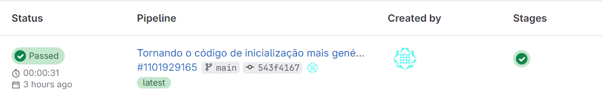
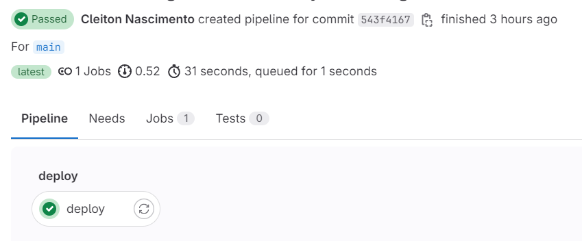
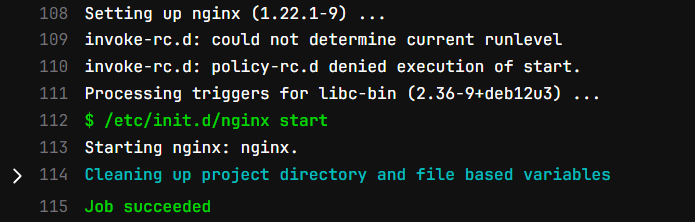

<p align="center">
  <a href="" rel="noopener">
 </a>
</p>

<h1 align="center">Criando uma pipeline que faz o deploy do NGINX e que executa ele automaticamente após cada alteração</h1> 
<p align="center"><i>Pipeline criada através da interface do GitLab</i></p>

## 📑 Requisitos

- Ter uma conta no GitLab.

## 📝 Tabela de conteúdos
- [Criando arquivo YAML que faz o Deploy do Nginx no GitLab (Passo 1)](#step1)
- [Referências](#documentation)

## ⚙️ Criando arquivo YAML que faz o Deploy do Nginx no GitLab (Passo 1)<a name = "step1"></a>

1. Antes de qualquer coisa, certifique-se de ter "runners" disponíveis.
    
    - No GitLab, "runners" são agentes que executam seus trabalhos de CI/CD.

- Para visualizar os corredores disponíveis:

    - Vá para **Configurações > CI/CD** e expanda "Runners".

    - Caso não tenha "runners", siga essa documentação: [Como instalar GitLab Runner](https://docs.gitlab.com/runner/install/)

- Crie um repositório no GitLab.

<br>

2. Criando um arquivo YAML com instruções para o pipeline.

- A partir desse arquivo podemos definir:
    - A estrutura e a ordem dos trabalhos que o "runner" (máquina) deve executar.
    - As decisões que o "runner" deve tomar quando condições específicas são encontradas.

- Ao entrar no repositório, na barra lateral esquerda, selecione **Código > Repositório**

- Selecione a branch, em seguida selecione o ícone de adição (+) e crie um novo arquivo:

    

<br>

- Para "filename", digite ".gitlab-ci.yml" e depois copie essas instruções:

    - Instruções atualizadas para fazer o deploy e inicialização do NGINX.

    ```yaml
    stages:
      - deploy

    deploy:
      stage: deploy
      script:
        - apt-get update -qy
        - apt-get install -y nginx
        - /etc/init.d/nginx start
      only:
        - main  # Define que a pipeline será executada apenas quando houver alterações no branch main

    ```

    - Através desse job, atualizamos os pacotes e instalamos o NGINX.
    - Logo em seguida fazemos a inicialização com **"/etc/init.d/nginx start"**, este comando deve ser mais genérico e funcionar em uma variedade de ambientes (No meu caso funcionou dessa forma).

3. Selecione "Commit changes"

- O pipeline começa e executa os trabalhos (jobs) que você definiu no arquivo ".gitlab-ci.yml".

## ⚙️ Veja o status de sua pipeline e trabalhos (jobs)<a name = "step2"></a>

1. Vá para **Build > Pipelines**

- A pipeline criada deve ser mostrada.

    

<br>

- Veja a representação visual do pipeline selecionando o ID do pipeline:

    - Nesse caso só temos o "deploy".

    

<br>

- Visualize os detalhes de um trabalho selecionando o nome do trabalho. Por exemplo, **deploy**:

    

### - Pipeline de CI/CD no gitlab criada com sucesso!

<br>

## Referências utilizadas:<a name="documentation"></a>

- [Documentação do GitLab - Quickstart](https://docs.gitlab.com/ee/ci/quick_start/)
- [Documentação NGINX](https://nginx.org/en/linux_packages.html#instructions)
- [CI/CD YAML syntax reference](https://docs.gitlab.com/ee/ci/yaml/)
